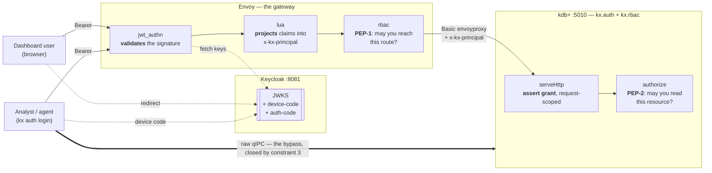
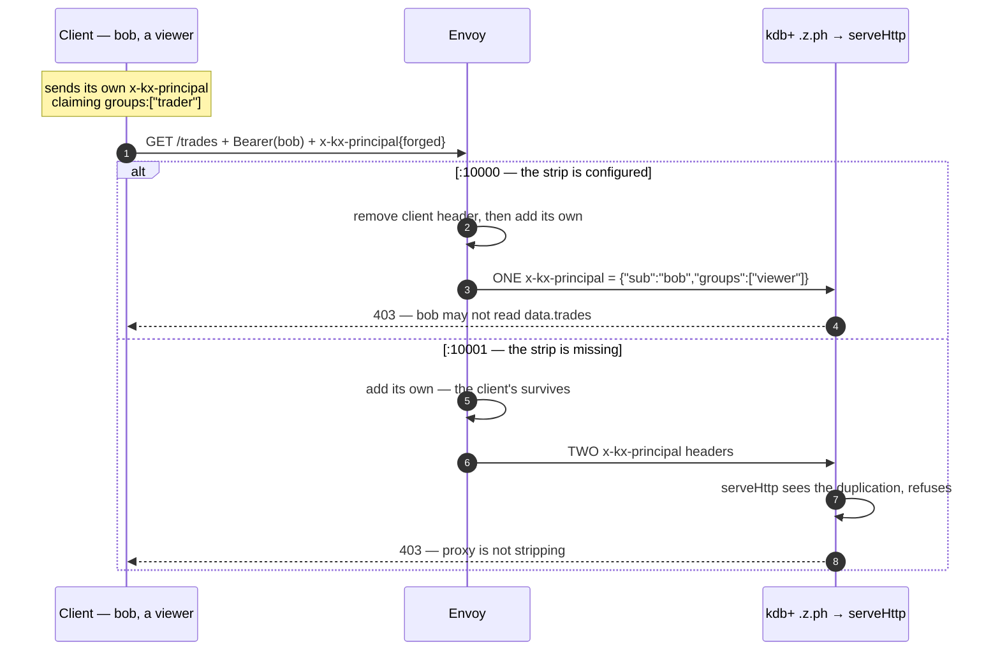

# envoy-gateway — interactive human access, with no MCP server in the path

A runnable Keycloak + Envoy + KDB-X stack that proves out the topology to use when **people** need to reach
a kdb+ system directly: an OAuth proxy in front of q.

```bash
bash demos/envoy-gateway/scripts/run.sh   # from the repo root
```

46 checks; exit 0 means every one passed. Add `--keep` to leave the stack up and poke at it.

Needs Docker with the compose plugin, `curl`, and a kdb+ licence file. It does **not** need a local q
install or the modules on a local module path — the q host runs in the KDB-X image with the modules mounted
into its module path, and the qIPC checks run inside the compose network.

## Why a proxy at all

`kx.auth` asserts an identity that something **upstream** already authenticated. q does no token parsing and
no cryptography — that is a declared non-goal, not an omission. A deployment with no MCP server in the path
is therefore missing two things, and a proxy supplies both:

| Missing | Supplied by |
|---|---|
| An **interactive** flow — `kx auth login` implements device-code only, never a browser redirect | Envoy's `oauth2` filter |
| A **validator** — `bind`/`serveHttp` decode claims *unverified* by design | Envoy's `jwt_authn` filter, against the realm's JWKS |

The second is the load-bearing one. **Without a validator anywhere in the path, a bearer is a claims
carrier, not a credential** — the security would rest entirely on the connection plus the assert grant, so
`--principal '{…}'` would carry the same claims with the same guarantees and acquiring a real token would be
decoration. A proxy is what makes a token mean something. `unsignedBearerIsRefusedByTheProxysValidator` is
that check.

It also splits the human personas, and leaves the CLI a job either way:

| Persona | Path | CLI in the request path? |
|---|---|---|
| Dashboard / browser user | Envoy `oauth2` filter → `x-kx-principal` → q | **No** — the browser is the client |
| Analyst or agent at a terminal | `kx auth login --server <proxy>`, then HTTP through the proxy | **No** — it acquires the bearer; an HTTP client presents it |

Both rows read **No** on purpose: the proxy is the terminus for every human path here. Going to q over raw
qIPC instead is the thing § Constraint 3 tells you to close, so it is not an end-user route — and reaching q
that way with an IdP identity would mean handing the caller the credential that lets it claim *any* identity,
which is a topology problem rather than a config one.

## The topology



That thick arrow is **not** a third way in. It is the hole: a raw qIPC connection skips every box above it,
which is what § Constraint 3 closes.

## The four constraints, and which of them q can enforce

Only one of these is enforceable inside the module. That asymmetry is why this demo exists.

### 1. The proxy holds the assert grant — *enforced by q*

Envoy authenticates **to q** with a real `-U` login (`envoyproxy`), that login resolves through
`setLoginGroups`, and the group it maps to holds `assert` on `kx.identity`. Exactly the question `bind`
asks over qIPC, through exactly the same policy — so "who may assert an identity" stays one group-keyed
grant rather than a second seam, and a proxy that is merely *authenticated* gets nowhere.

The demo proves the negative: the `/as-intruder/` route is the same Envoy, the same validated token and the
same header, but authenticates to q as a login that is **not** in the login map. `serveHttp` refuses.

**Perimeter trust is the documented fallback, and it is a crutch.** `setHttpTrustPerimeter[1b]` lets a
deployment that cannot yet map the proxy's login proceed anyway. It is off by default, consulted only
*after* the grant, and audits loudly on every single use:

```
kx.auth: WARNING asserting an HTTP principal on PERIMETER TRUST alone (login intruder,
no `assert grant on `kx.identity). The network is the only control on this path.
```

Prefer the grant, because the grant is *checkable* — `kx.rbac.grants[]` will show you who may assert, and
perimeter trust will not. `perimeterTrustAuditsLoudlyOnEveryUse` pins the audit line, not just the success.

### 2. Strip-then-set, or identity is forgeable — **the appended case fails closed; the strip itself q cannot verify**

If the proxy does not remove a client-supplied `x-kx-principal` before setting its own, a client sends
the header alongside the proxy's. This is the same class of defect as trusting a client-supplied
`X-Forwarded-For`. q cannot *verify* the proxy stripped — a single header is a single header, whether the
proxy sourced it or the client did. But it can catch the specific misconfiguration where the proxy
**appends** instead of replacing: that leaves **two** `x-kx-principal` headers, which is impossible under a
correct proxy, so `serveHttp` refuses rather than resolving by first match and binding the client's value.

The two listeners differ in one line of route config:

```yaml
# :10000 — correct. The projection filter strips, then sets.
- match: { prefix: "/" }
  route: { cluster: kdbx }
  metadata:
    filter_metadata:
      envoy.filters.http.lua:
        strip_client_principal: true      # ← delete this line and read on
```



Two mechanics worth knowing:

- **kdb+ keeps duplicate headers.** It presents `.z.ph` with a header dict containing *both* entries.
  `serveHttp` counts them and refuses when more than one `x-kx-principal` arrives, because a correct proxy
  produces exactly one. An *appending* proxy is therefore caught at q, not silently trusted.
- **This is not the same as verifying the strip.** A proxy that *replaced* the header with a wrong value —
  or sourced identity from something client-controlled — would still hand q one well-formed header it
  cannot distinguish from a legitimate one. The strip remains the proxy's responsibility; what q closes is
  the append-instead-of-strip case, which is the common way the strip gets forgotten.

`appendedPrincipalHeaderIsRefused` and `theForgedGroupNeverReachesData` assert that the appended forgery is
**refused**. The demo keeps the misconfigured listener so the failure mode stays visible: q fails closed.

### 3. A proxy is a boundary only if it is the sole path — *enforced by q, opt-in*

**kdb+ serves HTTP and qIPC on one port.** So no amount of network segmentation separates "reach `/trades`"
from "eval arbitrary q" — both arrive on 5010. Firewalling the port to the proxy closes both or neither.

What closes it is a grant. `activatePerimeter[]` composes a coarse gate onto `.z.pg`/`.z.ps` requiring
`eval` on `kx.q`:

```q
.kx.auth.activatePerimeter[];    / composes with any prior .z.pg/.z.ps handler
```

[`client.q`](q-scripts/client.q) shows both states: first that `select from trades` over a raw connection reads everything with
no authorization whatsoever — the host's `authorize` call lives *inside* `.demo.getTrades`, and a raw eval
never goes through it — and then that the same eval is refused once the gate is armed.

Three things to understand before arming it in production:

- **It is deliberately coarse.** It does not parse the q it is gating and must not pretend to: arbitrary q
  cannot be mapped honestly to an `(action;resource)` pair, and a gate that appeared to do so would be worse
  than none. `perimeterGateDoesNotInspectTheQItGates`.
- **It is not a substitute for the resource gate.** A caller past the coarse gate still meets `authorize`.
  `theResourceGateStillAppliesAfterTheCoarseOne`.
- **It also gates the module's own verbs.** `.z.pg` sees *every* sync request, `.kx.auth.bind` included — so
  a trusted intermediary asserting identities over qIPC needs `eval` on `kx.q` **in addition to** `assert`
  on `kx.identity` once the perimeter is armed. `theCoarseGateAlsoStopsBind` pins that, and it is the check
  most likely to save someone an afternoon.

The HTTP path is untouched by all of this — different `.z` handler family, separate opt-in. That is what
makes arming the gate viable rather than a choice between having a gateway and having a boundary.

### 4. Identity is request-scoped — *enforced by q*

`serveHttp` sets the request principal, runs the handler, and clears it afterwards **and on error**.

**kdb+ answers every HTTP request with `Connection: close` and closes the socket**, so keep-alive socket
reuse cannot arise on this transport: a second request on the same socket is met with a connection reset.
What makes the clearing load-bearing is different, and worse: the request principal is a process **global**, which `current[]` consults
*ahead of* any per-handle bound principal. A leak would therefore cross **connections**, not merely
requests — an HTTP request's identity would become the identity of every subsequent caller, including raw
qIPC ones.

So the demo pins the stronger property, twice: after a successful HTTP assertion *and* after a deliberately
failing one, a separate qIPC handle still decides as its own login. `/boom` exists to signal a non-denial
error, because `serveHttp`'s error trap is otherwise unreachable from outside the process. A path that
throws must not be a path that leaks.

## The layering: PEP-1 relocates, PEP-2 does not

A proxy sees method, path and headers. It can therefore relocate the **capability** decision — "may you
reach this route" — and nothing more. The **resource** decision stays in q, because only the node sees the
data. Envoy does not replace `kx.rbac`.

The demo makes that visible with two requests that both return **403** for entirely different reasons:

| Request | Refused by | Body |
|---|---|---|
| bob (viewer) → `/trades` | **Envoy**, from the verified claims. q is never consulted. | Envoy's RBAC text |
| alice (trader) → `/accounts` | **q** — nobody holds `read` on `data.accounts` | `{"denied":"denied: alice not permitted read on data.accounts"}` |

**Granular named routes are the precondition** for any of this buying anything. Front this process with a
single `POST /query` carrying arbitrary q or SQL and the proxy sees *one route* for every operation, so it
cannot distinguish `read:data.trades` from `read:data.accounts` without parsing the body — which is a
declared non-goal. Hence `/trades`, `/instruments`, `/accounts`; not `/query`.

## The interactive login

Publishing RFC 9728 protected-resource metadata **from the proxy** is enough for `kx auth login`, because
Envoy *is* the resource server. It is a static JSON route:

```yaml
- match: { path: "/.well-known/oauth-protected-resource" }
  direct_response:
    status: 200
    body:
      inline_string: |
        {"resource":"http://localhost:10000",
         "authorization_servers":["http://localhost:8081/realms/kx"]}
```

and then this works as-is:

```bash
kx auth login --server http://localhost:10000
```

## Policy administration through the same login

The same resource-server URL exposes a deliberately narrow, versioned RBAC surface under
`/kx/rbac/v1`. This is not a general q endpoint: the routes map only to `grants`, `check`,
`explain`, atomic `apply`/`replace`, and pathless `save`/`load`. Envoy validates the cached bearer and
projects the request principal exactly as it does on data routes; q remains the authority that enforces
`admin:kx.rbac`.

Alice has the demo realm's `policy-admin` role; Bob does not. Both can inspect the public grant set and
model decisions. Only Alice can commit:

```bash
kx auth login --server http://localhost:10000
kx rbac show --server http://localhost:10000 --json
kx rbac explain read:data.accounts --server http://localhost:10000 --json
kx rbac grant viewer read:data.trades --server http://localhost:10000 --json
```

The bearer lookup is the useful composition: `--token`, then `$KX_AUTH_TOKEN`, then the endpoint-keyed
credential written by `kx auth login`. Nothing asks the operator to copy qIPC connection credentials out
of the gateway. Direct `--connect` remains available for dev hosts and operational topologies where qIPC
is the intended control path.

Grant and decision visibility are public *inside the authenticated gateway*. That does not make policy
mutation public: `.kx.rbac.apply` crosses the same `admin:kx.rbac` gate as every other remote mutation.
An explicit `--principal` on `check`/`explain` is merely a hypothetical policy subject and can never
authenticate a grant or import.

Three requirements that are easy to miss:

- **It must be unauthenticated.** A client cannot present a credential it has not yet been told how to
  acquire, so the `jwt_authn` rules exempt `/.well-known/`.
- **It must answer 200 at the literal path.** The CLI does not follow redirects during discovery, so a 301
  to a trailing-slash variant is a discovery failure rather than a redirect.
- **There is deliberately no `--issuer` flag** to skip discovery. Such a flag would let a caller acquire a
  bearer that nothing in the deployment validates — inviting the reading that a token is proof kdb+ checked
  something. Better to have the topology make the existing flag correct.

Around the request path the CLI stays useful either way, and `scripts/login-check.sh` exercises both: `introspect`
as a genuine pre-flight ("does the token the proxy will forward validate against the JWKS the proxy has
configured?"), and `assert --connect` to confirm the qIPC leg decides the same way the proxy leg does.

**That second one is an operator's check, not a recipe to copy.** It connects as `envoyproxy` — the proxy's
own login, the one holding the grant — because whoever runs the gateway holds that credential already and is
entitled to ask whether both legs agree. Giving it to an end user's tool would be the mistake: that login can
assert *any* identity, so it belongs to the component serving many users, never to one acting for a single
user.

That parity check is worth a note. The two legs project a **different subject** on purpose — Envoy's Lua
projects `preferred_username` (so audit lines read `alice` rather than a UUID) while the CLI projects the
token's `sub` — and they still reach the same decision, because the decision keys on **groups**. Groups in
both cases come from Keycloak's `realm_access.roles` through `kx.auth`'s default claim search order, with no
mapper in Keycloak and no `setClaims` in q.

## What is in here

| File | |
|---|---|
| [`scripts/run.sh`](scripts/run.sh) | the orchestrator; generates credentials, waits for readiness, runs the three drivers |
| [`compose.yaml`](compose.yaml) | Keycloak + Envoy + the KDB-X q host |
| [`q-scripts/host.q`](q-scripts/host.q) | the q host: granular HTTP routes, grants declared through `grant[]`, `activateHttp[]` |
| [`envoy/envoy.yaml`](envoy/envoy.yaml) | three listeners — correct, deliberately forgeable, browser |
| [`envoy/principal.lua`](envoy/principal.lua) | the claims → `x-kx-principal` projection |
| [`keycloak/`](keycloak/) | the realm export, and [notes on what in it is load-bearing](keycloak/README.md) |
| [`scripts/checks.sh`](scripts/checks.sh) | the HTTP assertions, `curl`-driven |
| [`q-scripts/client.q`](q-scripts/client.q) | the raw-qIPC assertions: the bypass, open then closed |
| [`scripts/login-check.sh`](scripts/login-check.sh) | `kx auth login` against the metadata route; auto-skips without the CLI |
| [`q-scripts/ready.q`](q-scripts/ready.q) · [`qcall.q`](q-scripts/qcall.q) | the container healthcheck, and a one-expression qIPC probe the shell checks use to read q-side state |

Two demos, one family: [`local-assertion`](../local-assertion/) proves the same engine and the same grant
discipline over qIPC with a trusted intermediary in the path. Both declare their grants through
`kx.rbac.grant[]` at load time, so the q script stays the reviewable artifact.

## Things that will bite you

- **The audience mapper.** Envoy checks `audiences: [kdbx]`; Keycloak mints `aud: account` unless a client
  has an `oidc-audience-mapper`. Without it every request 401s at the gateway with nothing in the logs to
  say why.
- **The issuer string must match what Keycloak mints.** Keycloak derives `iss` from the request `Host`
  header unless pinned, so `compose.yaml` sets `KC_HOSTNAME_URL` and `envoy.yaml`'s `issuer:` lines agree
  with it. The JWKS *URL* is independent and does use the compose-internal name.
- **`jwt_authn`'s `claim_to_headers` is not enough.** It copies scalar claims to separate headers, whereas
  `serveHttp` wants one JSON object. Groups are an array, so a projection step is unavoidable — which is
  why it is a visible Lua file rather than a filter option.
- **`activateHttp[]` must come after your own `.z.ph`/`.z.pp`.** It *composes* over the prior handler; wiring
  your routes afterwards clobbers the module's wrapper and silently disables the whole assertion path. kdb+
  also leaves `.z.pp` unset by default, so POST needs an explicit definition.
- **Envoy logs `Jwks async fetching … failed` a few times at startup.** It begins fetching before Keycloak
  is listening and retries; the messages stop once the realm is up.

## Not a deployment template

- **Everything is plaintext HTTP on loopback.** A deployment terminates TLS at the proxy. Nothing here
  should be read as a TLS recommendation.
- **The proxy's upstream credential is in `envoy.yaml` in cleartext.** Demo passwords, generated by `scripts/run.sh`
  and thrown away on exit. Use an SDS secret, or better, replace HTTP basic with mTLS.
- **q's port 5010 is published deliberately** — the demo publishes it *in order to* prove the raw-qIPC
  bypass exists, and then closes it with `activatePerimeter[]`. Do not publish it.
- **The realm enables direct access grants** so `scripts/checks.sh` can mint tokens with one `curl` instead of
  driving a browser. That is a test affordance, not part of the taught topology.
- **The device-approval scrape is pinned to `keycloak:24.0`.** `scripts/login-check.sh` drives Keycloak's login and
  consent forms with `curl`. If the markup changes it fails loudly rather than skipping, which is the
  behaviour worth having — but it is the most fragile thing here.
- **The q image is registry-gated.** `scripts/run.sh` pulls it from the KX developer portal if
  it is missing; if the pull fails it says to `docker login portal.dl.kx.com`. Override with `KDBX_Q_IMAGE`.

## Not part of the required gate

This demo needs Docker and an image pull, so it is run by hand rather than on every change. The suites
that gate every change are:

```bash
q tests/test.q                        # the in-process suite
bash demos/local-assertion/run.sh     # the qIPC demo, with assertions
```
