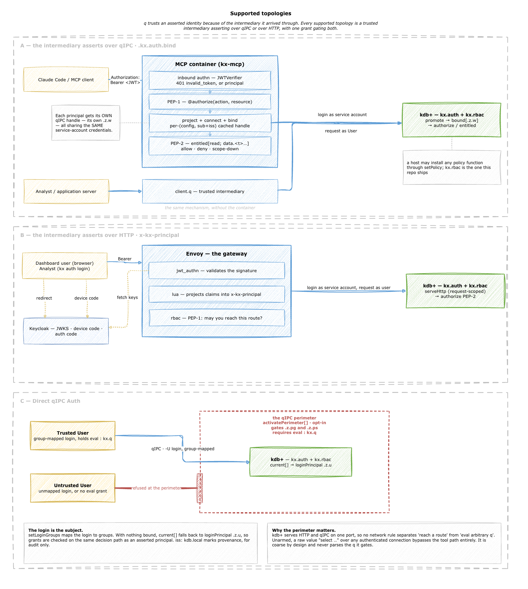

# Authorization for kdb+

## The problem

q ships hooks for login and for primitive authorization checks. `.z.pw` sees a username and a password,
`-U` holds a password file, and the message handlers let you intercept what arrives on a connection.
That is about where it stops. There is no notion of an external identity provider, no token handling,
and nothing that maps a person to what they are allowed to touch.

For most of kdb+'s history this was not much of a gap. A tickerplant and its subscribers sat inside a
network most people could not route to, and the firewall was the access control. Users who needed the
data got it through something else.

That arrangement is no longer the dominant topology. q systems are increasingly reachable by end users through APIs
exposed at a gateway, and once a real user is on the other end of the connection, network position
stops being a useful answer to who they are or what they may see. Authentication has to come from
whatever the organisation already runs, and authorization has to be something better than a hand-rolled
`if` in a query function.

These two modules are building blocks for that, not a finished security product.

## Two modules and a CLI

**`kx.auth`** composes with the authentication hooks q already has, and fills in the ones it leaves
empty. It captures any prior `.z.pw` and calls through to it, so a process already authenticating
through a `-U` file keeps working. The exception is `configure`, the built-in service-account verifier:
when it is set it replaces the prior `.z.pw` instead of composing with it, so use one or the other. It adds the HTTP and message handlers q leaves as no-ops. The result
is a defined way for an identity established upstream to arrive at a kdb+ process and be enforced there.

More importantly it defines a **policy-shaped hole**. Every decision goes through one function with a
fixed signature, installed by the deployment:

```q
policy:{[principal;action;resource] … }        / returns a boolean
```

`kx.auth` never looks inside it. A deployment can start with a switch-case that returns a thumbs up or
thumbs down for four cases, and replace it later with something that consults a vendor entitlements
system, without any of the surrounding machinery changing. The hole is the contract; what fills it is
the deployment's business.

**`kx.rbac`** is the first engine built to fill it. Group-keyed grants in one table, a decision in about
3 µs against a thousand rows, and a full administration surface with both q verbs and a CLI. It is a
policy decision point and an enforcement point in the same process, which is what keeps the decision on
the hot path affordable.

**The `kx auth` CLI** is the client-side half. q parses no tokens and performs no crypto, on purpose, so
the OAuth conversation happens out here: device-code login, RFC 8693 token exchange, and the claims
projection that produces something q can bind. It is also how an operator administers policy over either
transport.

Together they let a kdb+ process participate in an enterprise identity story without kdb+ needing to
understand any of it.

## Where authorization happens, and where it does not

The contract assumes gateway API functions are **designed to be authorizable**. Each entry point either
declares the action and resource it needs in advance, or computes them from the request before doing the
work.

Declared, for a stable published function:

```q
/ @authorize read data.trades
getTrades:.kx.auth.protect {[s] select from trades where sym=s };
```

A declared function passes no context to the policy, so it is for capability-only decisions. Where the
policy narrows by context (an entitlement window, a symbol list), call `scope` with the context and apply
its obligations instead.

Computed, where the target depends on the request:

```q
runReport:{[name]
  .kx.auth.authorize[`exec; `$"analytic.",string name];
  … };
```

What these modules deliberately do not attempt is dynamic enforcement inside the q engine at the point
of data access. Intercepting every read and deciding whether this principal may see these rows and columns would be the
deluxe answer, but in q it is not achievable with any confidence. The language offers too many routes to
the same data for interception to be foolproof, and an implementation that closed all of them would put
a policy check somewhere very hot indeed.

So the boundary is honest and simplified: authorization is enforced where an entry point declares or
computes what it needs. Anything reachable another way is outside it, and must be denied. The same reasoning is why the
perimeter gate is deliberately coarse and never inspects the q it gates, and why an `@authorize`
declaration carries literal values rather than an expression evaluated at call time.

## Two identities

The mechanism underneath rests on separating two things q normally conflates.

The **connecting process** authenticates the connection with a service-account login. This is ordinary
kdb+ authentication and `.z.pw` is all it involves.

The **end user** is *asserted* on that connection afterwards, and never logs in to kdb+ at all. A
trusted intermediary connects as itself, then declares who it is acting for. q accepts this because of
the connection it arrived on, and because the asserting login holds a grant saying it may assert. There
is no token to verify, which is exactly the point: the verification already happened upstream.

Asserting is itself just a grant, `assert` on `kx.identity`, checked against the same policy that
governs everything else. So "who may act on behalf of others" is one row in the same table as "who may
read trades", visible to the same audit.

A connection with nothing asserted is not anonymous. Its subject is the connecting login itself, given
groups through `setLoginGroups`, promoted through the same code path as an asserted principal, and
carrying `iss: kdb.local` so an auditor can tell the two apart.

## The policy contract

`authorize[action;resource]` is the decision verb. It establishes the subject from the current context, asks the installed
policy, and signals `'denied` if the answer is no.

`entitled[action;resources]` asks the same question for a list of resources and returns the subset that passed. This
is one shape an obligation takes: a caller asking for six tables gets back the four it may read,
and decides what to do about the other two.

`scope[action;resources;ctx]` is the general form both are shortcuts for, and it is what lets an engine go
further than a boolean. The caller declares the axes of its request — a time range, a set of instruments —
and gets back **obligations**: narrowings to apply before proceeding. A market-data licence that permits a
query but only over the last three months has an honest answer here that a boolean does not have.

The rule that keeps it safe is that **a policy may only narrow an axis the caller declared**; to constrain
anything else it must refuse. `resources` is always declared implicitly, though, so `authorize` — which
declares no context — can still be handed a `resources` obligation; it refuses one it cannot apply rather
than silently dropping it, which is what keeps it a boolean verb whatever policy is installed. Declaring
more context can only unlock a narrowing that would otherwise have been a flat refusal.

`explain[principal;action;resources;ctx]` reports the same decision instead of raising it, so a narrowing
can be inspected rather than only obeyed. It takes the principal explicitly, like `kx.rbac.check`:
enforcement reads the principal in effect, inspection is handed one.

Until a policy is installed, everything is refused, including the assert grant. There is no
configurable fail-open in the module.

Enforcement lands in two places, and they behave differently. A **capability** check asks whether a
caller may invoke something at all; it needs no knowledge of data, so it can sit in a proxy, a container,
or the host process. A **data gate** asks whether this principal may touch this specific resource, and
cannot move anywhere, because only the process holding the data can answer.

## What kx.rbac does with the hole

Grants are rows of three symbols: a group, an action, a resource. Groups come from the identity
provider, which has already resolved whatever nesting or composition it supports before minting the
token, so there is no separate role entity here to become a second place to look.

Actions match exactly. `write` does not imply `read`, because verb sets are small enough that
we don't need to introduce a separate concept like "subsumption" plus we avoid the surprise when a write grant
turns out to permit reads.

Resources are dotted paths, and a grant covers descendants by segment:

| Grant | Request | Covered |
|---|---|---|
| `data.trades` | `data.trades.price` | yes |
| `data.trades` | `data.tradesecret` | no |
| `data.trades` | `data` | no |

The middle row is the one that matters. A naive string prefix would return true, which is why paths are
split into segments when a grant is stored rather than compared as text when a decision is made.

There are no deny rows. An exception is expressed by letting it shape the taxonomy: grant `data.public`
and leave `data.restricted` ungranted, so the sensitivity boundary shows up in the resource name instead
of hiding in a deny rule somebody has to go looking for.

## Topologies



Every supported deployment has a trusted intermediary asserting on a user's behalf. What varies is which
component plays that part.

Over **qIPC** the intermediary connects as a service account and calls `bind`. An MCP server does this;
so does an ordinary application server. The module does not distinguish them. The KX MCP
server is one such intermediary.

Over **HTTP** an OAuth proxy validates the bearer, projects the claims into a header, and forwards. This
is the answer for interactive human access, because a proxy can run an auth-code flow and validate a
token, and q will never do either.

**Direct qIPC** with no intermediary is not an absence of authorization. A group-mapped login is a
subject like any other and its grants are checked normally. What is absent is end-user identity, not
enforcement.

For deployments that do not treat qIPC as trusted-internal, `activatePerimeter[]` gates every remote
message on a grant. It is coarse on purpose and never parses what it gates, for the same reason the
engine does not enforce at data access.

## Administration

Policy changes go through the engine the policy itself governs. Any caller that arrived over a
connection needs `admin` on `kx.rbac`, and that includes a qIPC connection from the same machine. The
gate keys on `.z.w`, the handle a message came in on, which is zero only for code the process is running
for itself. A `hopen` to localhost gets a real handle and is gated like any other client.

What bypasses the gate is code already inside the process: its startup script, or its console. That
bypass costs nothing, because such code can call `.kx.auth.setPolicy` and swap the decision function
outright, so refusing it a single `grant` would protect nothing. It is also how the first grant gets
made, since a host declaring its baseline runs before there is any policy to authorize it.

Batched changes go through a transaction that validates, builds the candidate, checks it will not lock
anyone out, lints it, then writes the snapshot to disk **before** installing it in memory. A failed
write leaves the running policy untouched.

Only the lockout check refuses. The lint reports: a policy with a total wildcard, or with an asserter
tier that also holds data grants, commits like any other. Those are things to notice, not things a
transaction can sensibly veto.

The policy persists as native kdb data. `save` is a `set` and `load` is a `get`, so there is no
serialisation format in the middle, nothing to parse, and no library to depend on. The file holds the
same three-column table the engine runs against, which means any q process can open it and query it
without loading either module:

```q
q)select from get hsym `$"/etc/kx/grants" where act=`read
grp    act  res
-----------------------
trader read data.trades
```


Two grants are protected from removal, because losing the last holder of either strands the deployment:
`assert` on `kx.identity`, without which no session can be established, and `admin` on `kx.rbac`,
without which no remote caller can repair anything. The guard only refuses removal of the last holder of
a grant that currently has one, so bootstrapping in any order still works.

## Vocabulary

| Term | Meaning |
|---|---|
| **promotion** | Canonicalising a principal into policy-facing fields. One implementation, every transport. |
| **principal** | A dict describing the subject. Promotion refuses one whose fields do not have the documented shape. |
| **claims** | The raw payload, kept as char vectors for audit. Policies do not read it. |
| **subject** | Who is asking. Always a promoted principal, never a raw token. |
| **grant** | One row: group, action, resource. |
| **group** | What every grant is keyed on. From the IdP, or from a login via `setLoginGroups`. |
| **action** | What the caller wants to do. Deployment-defined; the engine validates structure, not vocabulary. |
| **resource** | What they want to do it to, as a dotted path. |
| **cover** | Whether a grant's path contains the requested one, matched segment by segment. |
| **wildcard** | A null action or resource. Groups are never null. |
| **assert** | Putting a principal in effect on a connection. Gated by its own grant. |
| **obligation** | A narrowing of one declared axis: allow, but only this much. The permitted subset of resources is one; a clipped time range is another. |
| **context** | What the caller declares about its request — the axes a policy is permitted to narrow. Optional; declaring none makes the decision a boolean. |

## Where to go next

* [`kx.auth` reference](../modules/kx/auth/docs/references/auth.md): exports, principal shape, activation
  families, declared authorization, and what a deployment must supply that q cannot enforce
* [`kx.rbac` reference](../modules/kx/rbac/docs/references/rbac.md): grants, cover, transactions,
  persistence
* [`kx auth` CLI](../packages/kx-auth-cli/README.md): login, token exchange, assertion, policy
  administration
* [Architecture decisions](decisions.md): the records behind the choices above
